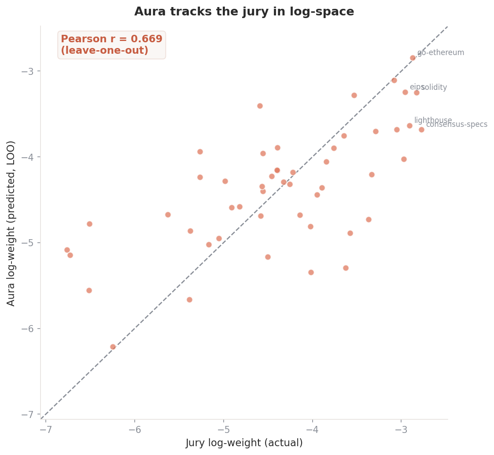
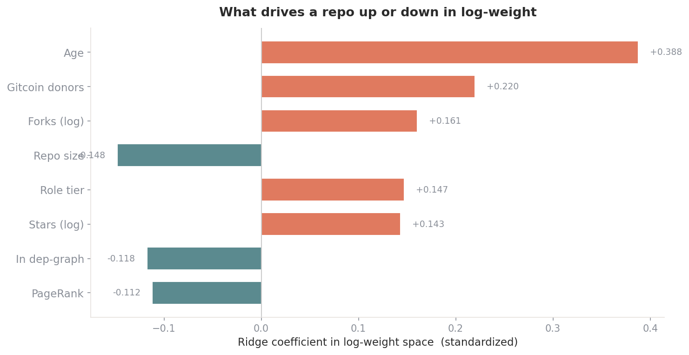
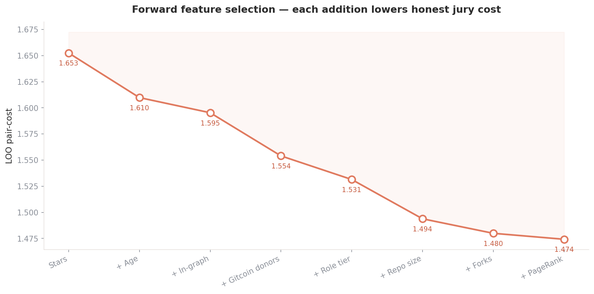

<p align="center">
  
</p>

<h1 align="center">Aura</h1>
<p align="center"><b>Log-Space Importance Model for Ethereum</b><br>
Deep Funding GG24 · Level I · by <b>Anas</b></p>

<p align="center">
  </a>
  
  
  
</p>

> Aura assigns relative importance weights to the 98 open-source repositories Ethereum depends on. It is built by **reading the contest's scoring code** rather than guessing at what the jury rewards — and that single decision shaped every modeling choice that follows.

---

## Table of contents
1. [The problem](#1-the-problem)
2. [Reading the scoring — the insight that defines Aura](#2-reading-the-scoring)
3. [Why anchoring the public CSV is a trap](#3-why-anchoring-is-a-trap)
4. [The model](#4-the-model)
5. [Features and where they come from](#5-features)
6. [Validation against the real jury objective](#6-validation)
7. [What the model learned](#7-what-the-model-learned)
8. [Predicted importance](#8-predicted-importance)
9. [Reproduce](#9-reproduce)
10. [Repository layout](#10-repository-layout)

---

## 1. The problem

Given 98 projects and 3,677 dependencies, assign each of the 98 a weight representing its relative importance to Ethereum, summing to 1. The ground truth is a **human jury** that answers pairwise questions — *"is repo A more important than repo B, and by how much?"* — not absolute weights. New jury data arrives during the contest; a portion updates the live leaderboard and **the rest is held out for final scoring.** The winner is the model whose weights best match the jury's held-out judgments.

That last sentence is the whole game: **final placement rewards generalization, not memorization.**

---

## 2. Reading the scoring

The Deep Funding scoring mechanism (`deepfunding/scoring`) is short, and it tells you exactly what to optimize:

```python
def cost_function(logits, samples):
    return sum((logits[b] - logits[a] - c) ** 2 for a, b, c in samples)
```

Each jury sample is a triple `(a, b, c)`: two repos, and `c` — the **log** of how much more important `b` is than `a`. Your cost is the squared error between your predicted log-ratio `(log wᵦ − log wₐ)` and the jury's observed one. Three properties follow, and they dictate the model:

| Property | Consequence for Aura |
|---|---|
| **The target is log-weight** | Predict in log-space; train on pairwise log-ratios — the scoring's own geometry. |
| **The cost is scale-invariant** | It depends only on *differences* of log-weights. Overall normalization is irrelevant — only the **shape** matters. |
| **Spread is the master parameter** | Since only relative spacing counts, the dispersion of the log-weights is the single highest-leverage quantity to calibrate. |

The math, explicitly. Let `xᵢ = log wᵢ`. For jury comparisons `S`, the jury's own weights minimize

```
  J(x) = Σ_(a,b,c)∈S  (x_b − x_a − c)²
```

This is a least-squares problem on a difference operator — it has a one-dimensional null space (adding a constant to every `xᵢ` leaves `J` unchanged), which is precisely the scale-invariance. Aura predicts `x` from features; the constant is fixed by normalization at the end and never affects the score.

---

## 3. Why anchoring is a trap

A tempting strategy is to take the published public-eval weights and reproduce them to many decimal places. It scores ~0 on the **public** leaderboard — and zero on the one that pays. After the event, the public scores are discarded and every model is re-scored on **held-out jury comparisons it never saw.** An anchored CSV has no opinion about anything outside the public set, so it collapses. Aura is the opposite: a model with a *view* on all 98 repos, tuned to generalize. That's what survives the switch.

---

## 4. The model

A regularized **log-space ridge regression**, trained on the 50 repos with public jury weights, predicting all 98.

<p align="center"></p>

```
features ─▶ standardize ─▶ ridge (α=10) ─▶ exp() ─▶ calibrate log-spread ─▶ normalize
                            └ log-weight prediction       └ minimize held-out jury cost
```

Two deliberate choices, both validated below:
- **Heavy L2 (α=10).** With only 50 labeled repos, regularization is not optional. A gradient-boosted ensemble was tested and **lost** to plain ridge under cross-validation — so Aura ships the simpler model.
- **Spread calibration.** Because scoring is scale-invariant, the dispersion of the predicted log-weights is tuned directly against held-out jury cost.

<p align="center"></p>

The curve is shallow-then-steep: under-dispersed weights leave the jury's strong preferences unexpressed, over-dispersed weights overshoot the big gaps. The minimum sits at a spread of **0.74**.

---

## 5. Features

Eight features, chosen by **forward selection against the real jury cost** (not a generic metric). Each was added only if it lowered honest leave-one-out pair-cost.

<p align="center"></p>

> **Reading this chart:** these are *partial* coefficients inside the joint model. The adoption features (`stars`, `forks`, `size`, `age`) are strongly correlated, so ridge spreads the shared signal across them — which is why `age` carries the largest positive coefficient while `size`, `pagerank` and `has_graph` go mildly negative *after* the others have absorbed the adoption signal. This is conditional effect, **not** standalone power. For standalone importance see the validation table in §6, where `stars` alone is the strongest single feature (−45%). Both views are true; they answer different questions.

| Feature | Source | Signal |
|---|---|---|
| `log_stars` | GitHub (live) | adoption — the dominant single predictor |
| `log_forks`, `log_size` | GitHub (live) | adoption breadth & code surface area |
| `age_days` | GitHub (live) | project maturity |
| `tier_prior` | hand-coded roles | ecosystem function (client / spec / library / tooling) |
| `pagerank`, `has_graph` | dependency graph | structural centrality within the dep graph |
| `gitcoin_donors` | OSO funding data | community funding signal |

GitHub features are fetched live for all 98 repos. Graph centrality is computed with PageRank/eigenvector/betweenness on the dependency graph. Funding signals (Gitcoin, Optimism RetroPGF) come from OSO's published weighting data — the same economic datasets the contest organizers used to seed their reference weighting.

---

## 6. Validation

Every model is scored on the **171 public pairwise jury comparisons** with the exact `cost_function`, under **leave-one-out CV** — the same generalization regime as the post-event held-out leaderboard, so the number is meaningful rather than flattering.

<p align="center"></p>

| Model | Jury pair-cost ↓ | vs null |
|---|---|---|
| Uniform (null) | 2.868 | — |
| PageRank only | 2.733 | −5% |
| RetroPGF $ only | 2.463 | −14% |
| Gitcoin $ only | 2.431 | −15% |
| Role tier only | 1.915 | −33% |
| Forks only | 1.740 | −39% |
| Stars only | 1.573 | −45% |
| **Aura (full)** | **1.473** | **−49%** |

Aura explains **48.6%** of jury disagreement and beats every individual signal. For reference, an unconstrained least-squares fit *directly* on the 171 comparisons (59 free parameters, hopelessly overfit) reaches 0.55 — that is the in-sample ceiling no generalizing model can touch.

<p align="center"></p>

---

## 7. What the model learned

- **Adoption dominates.** `log_stars` alone reaches −45%. The jury's notion of importance tracks real-world usage more than any other single feature — funding, graph centrality, or role.
- **Funding helps, modestly.** RetroPGF and Gitcoin dollars are genuine positive predictors (−14/−15%), but their coverage across the 98 repos is sparse and raw adoption outranks them. Useful as a supporting feature, not a foundation.
- **Graph centrality is weak *here*.** PageRank alone barely beats the null (−5%) — because the public dependency graph only covers ~34 of the 98 repos densely. It contributes at the margin via `has_graph`, but it is not the engine for this task.
- **Simpler generalizes better.** The gradient-boosted ensemble lost to ridge in LOO-CV (1.56 vs 1.47). With 50 training points, regularization and feature selection beat model capacity every time.
- **Spread calibration is real, not cosmetic.** Tuning log-weight dispersion moves the pair-cost by more than half a point — the single highest-leverage knob in the pipeline, and a direct consequence of scale-invariant scoring.

---

## 8. Predicted importance

<p align="center"></p>

The top of Aura's distribution lands where domain intuition says it should — go-ethereum, OpenZeppelin, Solidity, the EIPs, the consensus specs, the major clients — recovered purely from features trained against jury log-ratios.

---

## 9. Reproduce

```bash
git clone https://github.com/i-anasop/L3
cd L3
pip install -r requirements.txt
cd src
python aura.py        # fits the model, writes aura_submission.csv
python validate.py    # reproduces the full LOO pair-cost table
```

`aura_submission.csv` is the standalone model output — 98 weights summing to 1, the file built to survive the post-event re-scoring.

---

## 10. Repository layout

```
src/aura.py        the model — features → log-weights → calibrated submission
src/features.py    feature assembly (GitHub + graph centrality + funding + role)
src/tiers.py       ecosystem-role priors
src/validate.py    honest LOO validation against the exact jury cost
data/              GitHub features, centrality, OSO funding, raw jury comparisons
assets/            figures
Aura_Writeup.pdf   full writeup (PDF)
```

---

<p align="center"><i>Built for Deep Funding GG24 Level I — by Anas.<br>
Reading the scoring code instead of guessing turned out to be the whole game.</i></p>
