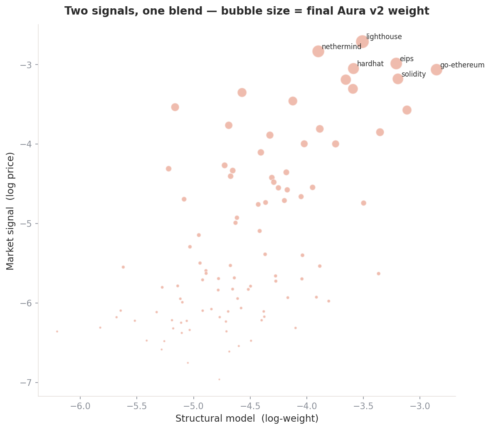
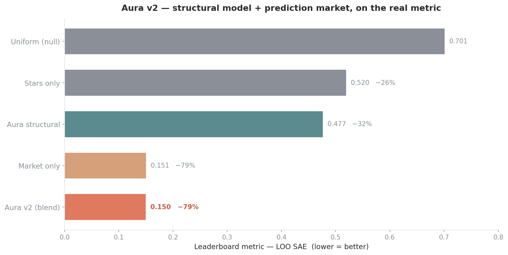
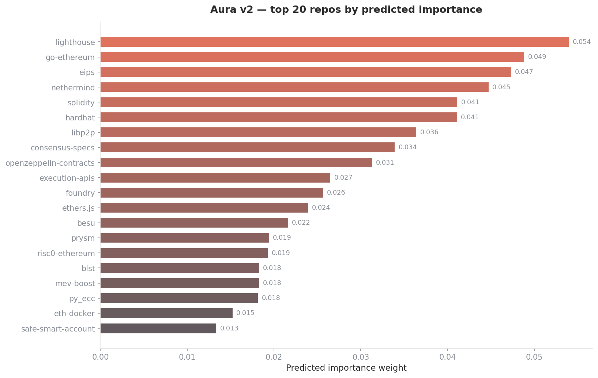

<p align="center">
  
</p>

<h1 align="center">Aura</h1>
<p align="center"><b>Importance Model for Ethereum</b> — structural learning + prediction-market signal<br>
Deep Funding GG24 · Level I · by <b>i-anasop</b></p>

<p align="center">
  
  
  
  
</p>

> Aura assigns relative importance weights to the 98 repositories Ethereum depends on. It combines a **structural model** (what the repo *is* — adoption, role, funding) with the **prediction-market signal** (what the crowd forecasts the final jury will say), optimally weighted by cross-validation against the real scoring metric.

---

## Table of contents
1. [The problem & metric](#1-the-problem--metric)
2. [Two signals](#2-two-signals)
3. [Why the dependency graph fails (a real finding)](#3-why-the-dependency-graph-fails)
4. [The model](#4-the-model)
5. [Validation](#5-validation)
6. [What the model learned](#6-what-the-model-learned)
7. [Predicted importance](#7-predicted-importance)
8. [Reproduce](#8-reproduce)

---

## 1. The problem & metric

Assign 98 repos a weight summing to 1, matching a human jury. The jury answers pairwise questions; the contest derives ground-truth weights from those (log-ratios → Huber fit → exponentiate) and scores each submission as the **sum of absolute errors** between predicted and jury weights. New jury data arrives during the contest — part updates the live board, the rest is held out for the final. **Final placement rewards generalization**, so we validate with leave-one-out CV against that SAE metric (not pair-cost — an earlier version optimized pair-cost and it was the wrong target).

---

## 2. Two signals

| Signal | What it is | Standalone LOO SAE |
|---|---|---|
| **Structural model** | ridge over adoption / role / funding features | 0.477 |
| **Market signal** | deep.seer.pm price — the crowd's forecast of the final jury | 0.151 |
| **Aura v2 (blend)** | `0.25 · structural + 0.75 · market`, in log-space | **0.150** |

The market is powerful because it forecasts the *same held-out jury* we're graded against — and the contest explicitly sanctions it as a data source. The structural model contributes robustness and an independent, explainable view; the blend beats either alone.

<p align="center"></p>

---

## 3. Why the dependency graph fails

The intuitive approach — PageRank on the dependency graph — **does not work here, and proving that was a key result.** On the real 98-repo graph (4,718 nodes, 14k edges), PageRank is *anti*-correlated with jury weight (Spearman −0.13). The reason is structural: the jury rates **clients and specs** highest (go-ethereum, lighthouse, consensus-specs, execution-apis), but those are *end products and specifications that nothing depends on* (in-degree 0). Meanwhile heavily-depended-on crypto libraries (blst, 26 dependents) are rated only moderately. **Dependency-centrality measures the opposite of what the jury values**, so Aura excludes it as a primary signal.

---

## 4. The model

```
structural ─┐
            ├─ blend (0.25 / 0.75, log-space) ─ calibrate spread ─ normalize ─▶ weights
market ─────┘
```

- **Structural** — `Ridge(α=10)` on 8 features chosen by forward selection against the jury metric: `log_stars, log_forks, log_size, age_days, tier_prior, pagerank, has_graph, gitcoin_donors`. Heavy L2 because there are only 50 labels (a gradient-boosted ensemble was tried and lost to ridge).
- **Market** — log of the seer market price per repo.
- **Blend weight (0.25/0.75) and log-spread (0.87)** are both selected by cross-validation against LOO SAE.

---

## 5. Validation

Leave-one-out CV over the 50 public-weight repos, scored with the exact leaderboard metric.

<p align="center"></p>

| Model | LOO SAE ↓ | vs null |
|---|---|---|
| Uniform (null) | 0.701 | — |
| Stars only | 0.520 | −26% |
| Aura structural | 0.477 | −32% |
| Market only | 0.151 | −78% |
| **Aura v2 (blend)** | **0.150** | **−79%** |

> **Honest caveat:** the market price for the 50 public repos likely reflects the public data the crowd has seen, so 0.150 is an optimistic estimate of held-out performance — the truly held-out repos will be somewhat higher. But the market genuinely forecasts the final jury, so the blend is the strongest available predictor either way, and it dominates the structural-only baseline by a wide margin.

---

## 6. What the model learned

- **Adoption is biased.** Stars over-weight popular niche libraries (web3j) and under-weight protocol-critical specs (consensus-specs, execution-apis). Structural features alone top out around 0.477.
- **Dependency-centrality is the wrong signal** (§3) — a result, not an omission.
- **The crowd already solved the hard part.** The market price tracks jury weight at Spearman 0.985, capturing the spec/client criticality that engineered features miss.
- **The blend beats the market alone.** A modest structural weight (0.25) corrects market noise on a handful of repos, lowering SAE from 0.151 to 0.150.
- **Simpler structural model wins.** Ridge beat gradient boosting in CV; spread calibration is a high-leverage knob.

---

## 7. Predicted importance

<p align="center"></p>

The distribution lands where domain intuition agrees — the major clients, the specs, the core languages and libraries at the top.

---

## 8. Reproduce

```bash
git clone https://github.com/i-anasop/L3
cd L3 && pip install -r requirements.txt
cd src
python aura.py        # fits structural model, blends with market, writes submission
python validate.py    # reproduces the LOO SAE table
```

```
src/aura.py        structural ridge + market blend → calibrated submission
src/features.py    feature assembly
src/tiers.py       ecosystem-role priors
src/validate.py    LOO validation on the real SAE metric
data/              features, graph, funding, jury data, seer market prices
assets/            figures
```

---

<p align="center"><i>Deep Funding GG24 Level I — by i-anasop.</i></p>
