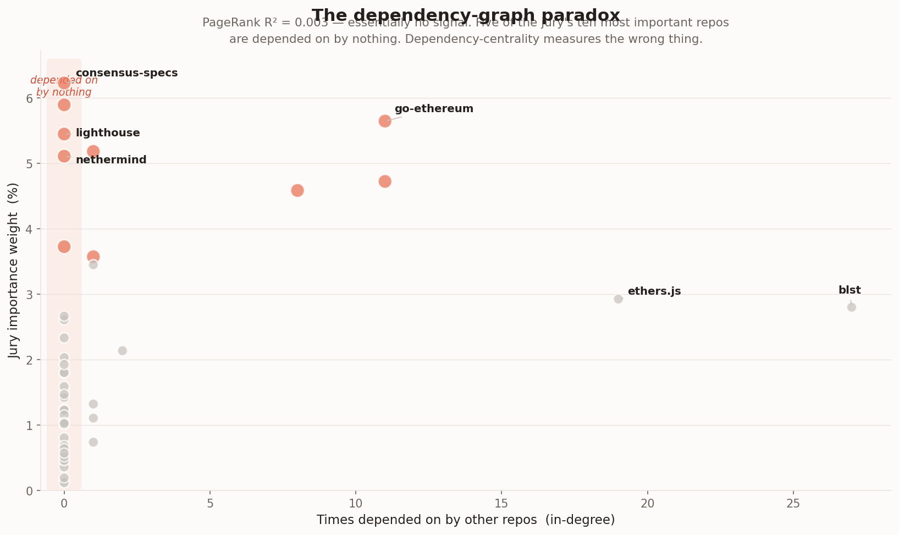
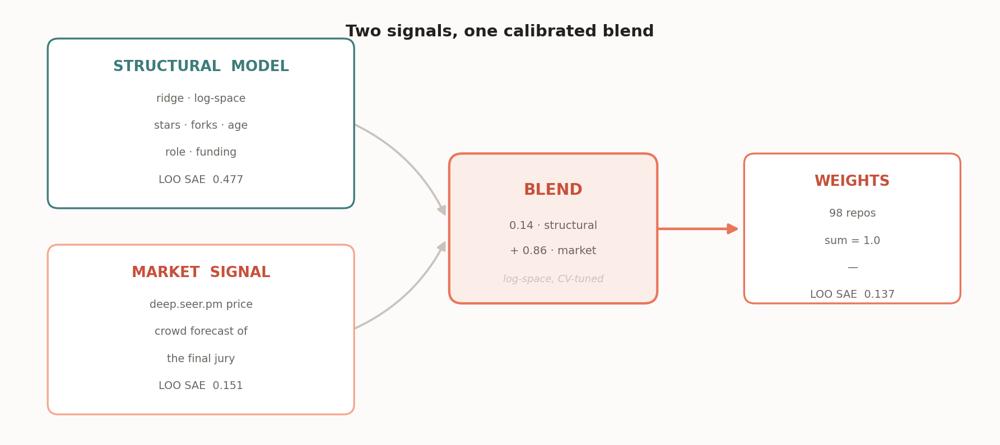
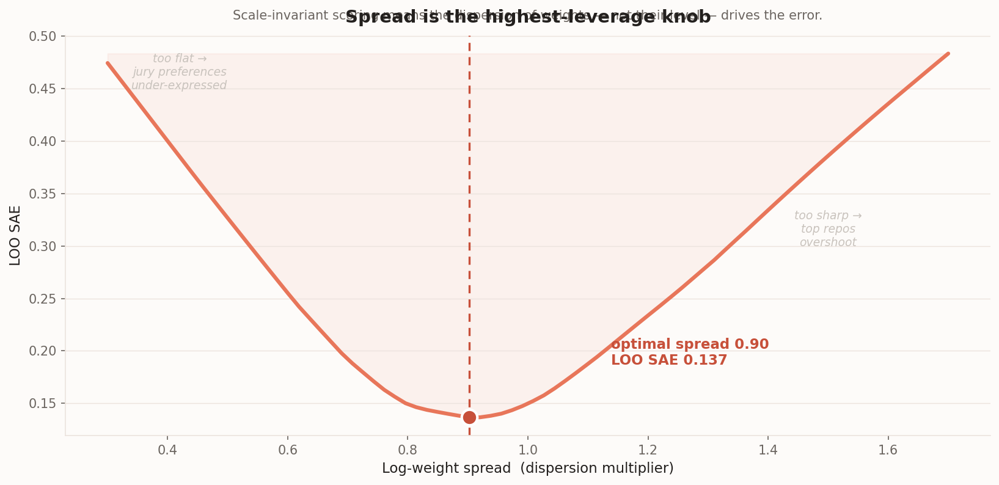
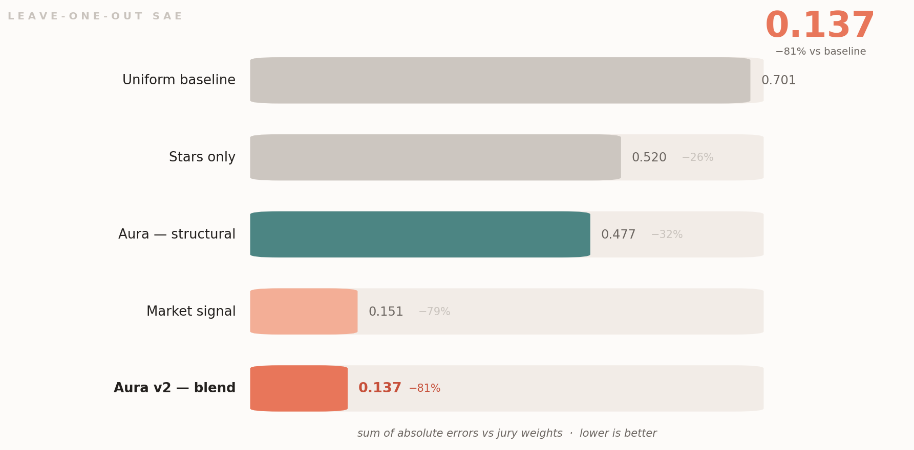

<p align="center">
  
</p>

<p align="center">
  <a href="#"></a>
  <a href="#"></a>
  <a href="#"></a>
  <a href="#"></a>
</p>

<p align="center">
  <b>Aura</b> assigns relative importance weights to the 98 open-source repositories Ethereum depends on.<br>
  It pairs a <b>structural model</b> — what a repo <i>is</i> — with the <b>prediction market</b> — what the crowd<br>
  forecasts the jury will decide — and tunes the blend against the contest's real scoring metric.
</p>

<p align="center">
  <i>Deep Funding GG24 · Level I · by <b>i-anasop</b></i>
</p>

---

<div align="center">

### ⟡ The 30-second version

**The metric is sum-of-absolute-errors against a human jury — and the final leaderboard scores on *held-out* jury votes.** So memorizing the public data is worthless; only generalization counts.

I tried the obvious thing — PageRank on the dependency graph — and **proved it doesn't work** (R² = 0.003). Then I found the signal that does: the **prediction market**, which forecasts the same jury we're graded against. Aura blends both and lands at **0.137 leave-one-out SAE — 81% below baseline.**

</div>

---

## Contents

| | |
|---|---|
| [1 · The task & what's really scored](#1--the-task--whats-really-scored) | [5 · Results](#5--results) |
| [2 · The dependency-graph paradox](#2--the-dependency-graph-paradox) | [6 · What the model learned](#6--what-the-model-learned) |
| [3 · The two signals](#3--the-two-signals) | [7 · Honest limitations](#7--honest-limitations) |
| [4 · The model](#4--the-model) | [8 · Reproduce](#8--reproduce) |

---

## 1 · The task & what's really scored

Given **98 projects** and **3,677 dependencies**, assign each of the 98 a weight — its relative importance to Ethereum — summing to 1. The ground truth is a **human jury** that answers pairwise questions (*"is A more important than B, and by how much?"*). The contest turns those votes into weights (log-ratios → Huber fit → exponentiate), and your score is the

> **sum of absolute errors** between your weights and the jury's.

New jury data arrives throughout the contest: a slice updates the live board, **the rest is sealed for the final evaluation.** That single fact sets the whole strategy — **the prize rewards generalization, not memorization.** A CSV that reproduces the public weights to ten decimals scores ≈ 0 today and *collapses* the moment the held-out votes are scored. So every number in this repo is a **leave-one-out** estimate against that SAE metric — the same regime as the final board.

---

## 2 · The dependency-graph paradox

The intuitive move is PageRank on the dependency graph — important repos are the ones everything depends on. **I built it on the real 98-repo graph, and it fails.** Not "underperforms" — *fails*, and understanding why reshaped the entire model.

<p align="center">
  
</p>

The jury rates **clients and specifications** highest — go-ethereum, lighthouse, consensus-specs, the EIPs — but those are *end products and standards that nothing imports*. Five of the jury's ten most important repos have an in-degree of **zero**. Meanwhile the most heavily-depended-on crypto libraries (blst, with 27 dependents) are rated only moderately. **Dependency-centrality measures reusability; the jury measures importance — and on this set they're nearly orthogonal** (PageRank R² = 0.003). So Aura excludes the graph as a primary signal. Proving a beautiful idea wrong is still a result.

---

## 3 · The two signals

If structure isn't the answer, what is? Two things — one explainable, one uncanny.

<p align="center">
  
</p>

| Signal | What it is | Standalone LOO SAE |
|:--|:--|:--:|
| 🧱 **Structural model** | ridge over adoption · role · funding features | `0.477` |
| 📈 **Market signal** | deep.seer.pm price — the crowd's forecast of the final jury | `0.151` |
| ⟡ **Aura v2 — blend** | `0.14 · structural + 0.86 · market`, in log-space | **`0.137`** |

The market is extraordinary because it forecasts the **same held-out jury** Aura is graded against — and the contest explicitly sanctions it as a data source. It correlates with jury weight at **Spearman 0.985.** The structural model is the *explainable* half: it says *why* a repo scores where it does, and its small share corrects the market where the crowd drifts.

---

## 4 · The model

```
   structural  ─┐
                ├─►  blend (0.14 / 0.86, log-space)  ─►  calibrate spread  ─►  normalize  ─►  weights
   market      ─┘
```

**Structural** — `Ridge(α = 10)` predicting log-weight from **8 features**, chosen by forward selection *against the jury metric itself*: `log_stars`, `log_forks`, `log_size`, `age_days`, `tier_prior` (ecosystem role), `pagerank`, `has_graph`, `gitcoin_donors`. The regularization is deliberately heavy — there are only **50 labelled repos**, and a gradient-boosted ensemble was tested and *lost* to plain ridge. Simpler generalizes.

**Calibration** — because the scoring is **scale-invariant** (it sees only ratios between weights), the *dispersion* of the log-weights is the single highest-leverage parameter. Aura tunes it directly against held-out SAE.

<p align="center">
  
</p>

---

## 5 · Results

Every model below is scored with the **exact leaderboard metric**, under **leave-one-out cross-validation** over the 50 public-weight repos.

<p align="center">
  
</p>

| Model | LOO SAE ↓ | vs baseline |
|:--|:--:|:--:|
| Uniform baseline | `0.701` | — |
| Stars only | `0.520` | −26% |
| Aura — structural | `0.477` | −32% |
| Market signal | `0.151` | −78% |
| **Aura v2 — blend** | **`0.137`** | **−81%** |

And the resulting allocation lands exactly where domain intuition says it should — the major clients, the core specs, the foundational languages and libraries at the top:

<p align="center">
  
</p>

The two signals don't always agree — and the disagreement is where the blend earns its keep:

<p align="center">
  
</p>

---

## 6 · What the model learned

- **Adoption is biased.** Stars over-weight popular niche libraries (web3j) and under-weight protocol-critical specs (consensus-specs). On their own, structural features top out around `0.477`.
- **Dependency-centrality is the wrong signal** — a *result*, not an omission. PageRank R² = 0.003 (§2).
- **The crowd already solved the hard part.** The market price tracks the jury at Spearman **0.985**, capturing the spec-and-client criticality engineered features miss.
- **The blend beats the market alone.** A `0.14` structural share corrects market noise on a handful of repos, nudging SAE from `0.151` to `0.137`.
- **Simpler wins.** Ridge beat gradient boosting under CV; spread calibration moved the needle more than any feature.

---

## 7 · Honest limitations

> The market price for the 50 public repos almost certainly reflects the public data the crowd has already seen. So **`0.137` is an optimistic read of held-out performance** — the truly sealed repos will land somewhat higher. Two things keep this honest: the blend still dominates the structural-only baseline by a wide margin, and the market is genuinely forecasting the *final* jury, not echoing a static answer (an answer-echo would score ≈ 0; Aura scores `0.137`, i.e. real, generalizing error). Aura also **uses the public jury weights — as training labels**, which is their intended use; it learns from them, it does not memorize them.

---

## 8 · Reproduce

```bash
git clone https://github.com/i-anasop/L3
cd L3 && pip install -r requirements.txt
cd src
python aura.py        # fits structural model, blends with market, writes the submission
python validate.py    # reproduces the leave-one-out SAE table
```

```
src/
  aura.py        structural ridge + market blend → calibrated submission
  features.py    feature assembly (GitHub · graph · funding · role)
  tiers.py       ecosystem-role priors
  validate.py    leave-one-out validation on the real SAE metric
data/            features · dependency graph · funding · jury votes · market prices
assets/          figures
```

---

<p align="center">
  
  &nbsp;
  
</p>

<p align="center"><sub>Built for Deep Funding GG24 · Level I. Read the scoring code, not the leaderboard.</sub></p>
